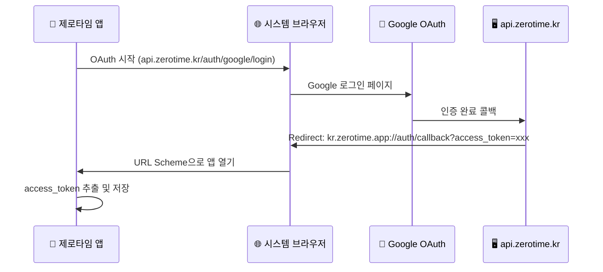

# Capacitor 기반 iOS/Android 앱 변환 계획

Next.js 16 기반의 `jbnu-alarm-app-v1`을 Capacitor를 사용하여 iOS/Android 네이티브 앱으로 변환하는 상세 계획입니다.

## 현재 프로젝트 분석

| 항목 | 현재 상태 |
|------|-----------|
| **프레임워크** | Next.js 16.1.1 + React 19.2.3 |
| **PWA** | @ducanh2912/next-pwa로 Service Worker 사용 중 |
| **인증 방식** | **쿠키 기반** (HttpOnly Secure Cookie) |
| **Access Token** | 메모리 저장 (`tokenStore.ts`) |
| **Refresh Token** | HttpOnly Secure Cookie (path: `/auth`, 14일) |
| **API Client** | `withCredentials: true` 설정으로 쿠키 자동 전송 |
| **서버 컴포넌트** | `layout.tsx`에서 `headers()` 사용 (host 감지용) |

---

## URL Scheme vs API URL vs Hostname 개념 정리

> [!NOTE]
> **세 가지 URL은 완전히 다른 용도입니다**

| 구분 | 용도 | 예시 | 실제 네트워크 요청? |
|------|------|------|---------------------|
| **URL Scheme** | 앱을 여는 Deep Link | `kr.zerotime.app://auth/callback` | ❌ 앱만 열림 |
| **API URL** | 백엔드 서버 호출 | `https://api.zerotime.kr/notices` | ✅ 실제 HTTP 요청 |
| **WebView Hostname** | 앱 내부 가상 도메인 (쿠키용) | `https://app.zerotime.kr` | ❌ 가상 (쿠키 공유용) |

### URL Scheme 네이밍 베스트 프랙티스

| 권장사항 | 설명 |
|----------|------|
| **역방향 DNS 형식** | `kr.zerotime.app` (도메인의 반대 순서) |
| **소문자 사용** | Android에서 대소문자 구분 이슈 방지 |
| **고유성 확보** | `app`, `myapp` 같은 일반적인 이름 피하기 |
| **버전 포함 (선택)** | `kr.zerotime.app://v1/auth/callback` |

### 선택 가능한 URL Scheme 예시

```
✅ 추천
kr.zerotime.app://           # 현재 선택 (역방향 DNS)
zerotime://                  # 짧고 간결

❌ 비추천
app://                       # 너무 일반적, 충돌 위험
jbnu-alarm://                # 브랜드와 무관
ZeroTime://                  # 대문자 (Android 호환성 이슈)
```

---

### OAuth Flow에서 URL Scheme 동작 방식




## User Review Required

> [!WARNING]
> **쿠키 기반 인증 + Capacitor 호환성 이슈**
> 
> Capacitor 앱은 **WKWebView (iOS)** / **WebView (Android)** 내에서 실행됩니다.
> - HttpOnly 쿠키는 `capacitor://localhost` 또는 `http://localhost` origin에서 전송됩니다
> - 백엔드 CORS 및 쿠키 설정에서 이 origin을 허용해야 합니다
> - `SameSite=Lax` 쿠키가 cross-origin에서 동작하려면 추가 설정 필요

> [!IMPORTANT]
> **Static Export 제한사항**
> 
> Capacitor는 정적 HTML/CSS/JS만 번들링하므로:
> - `layout.tsx`의 `headers()` 호출 → 빌드 오류 발생 예상
> - 해결책: 클라이언트 측에서 호스트 감지로 변경 필요

> [!CAUTION]
> **Google OAuth Native App Flow**
> 
> 네이티브 앱에서 OAuth redirect는 Custom URL Scheme이 필요합니다.
> - `kr.zerotime.jbnu.alarm://auth/callback`
> - Google Cloud Console에서 iOS/Android 클라이언트 ID 추가 필요

---

## Proposed Changes

### 1. Next.js Static Export 설정

#### [MODIFY] [next.config.ts](file:///Users/boseung/zerotime/jbnu-alarm-app-v1/next.config.ts)

Static Export 활성화:

```diff
 const nextConfig: NextConfig = {
+  output: 'export',
+  images: {
+    unoptimized: true,
+  },
   env: {
     NEXT_PUBLIC_API_BASE_URL: process.env.NEXT_PUBLIC_API_BASE_URL,
   },
 };
```

PWA 설정에서 Capacitor 빌드 시 비활성화:

```diff
 const withPWA = withPWAInit({
   dest: "public",
-  disable: process.env.NODE_ENV === "development",
+  disable: process.env.NODE_ENV === "development" || process.env.CAPACITOR_BUILD === "true",
 });
```

---

### 2. Server Component 호환성 수정

#### [NEW] [DevHostMetaTag.tsx](file:///Users/boseung/zerotime/jbnu-alarm-app-v1/app/_components/system/DevHostMetaTag.tsx)

`headers()` 대신 클라이언트 측 감지:

```typescript
'use client';
import { useEffect, useState } from 'react';

export default function DevHostMetaTag() {
  const [isDevHost, setIsDevHost] = useState(false);
  
  useEffect(() => {
    const host = window.location.host;
    setIsDevHost(host === 'dev.zerotime.kr' || host.startsWith('dev.zerotime.kr:'));
  }, []);
  
  if (!isDevHost) return null;
  
  return <meta name="robots" content="noindex, nofollow" />;
}
```

#### [MODIFY] [layout.tsx](file:///Users/boseung/zerotime/jbnu-alarm-app-v1/app/layout.tsx)

```diff
-import { headers } from 'next/headers';
+import DevHostMetaTag from './_components/system/DevHostMetaTag';

-export default async function RootLayout({ children }) {
-  const host = (await headers()).get('host') ?? '';
-  const isDevHost = host === 'dev.zerotime.kr' || host.startsWith('dev.zerotime.kr:');
+export default function RootLayout({ children }) {
   return (
     <html lang="ko">
       <head>
-        {isDevHost && <meta name="robots" content="noindex, nofollow" />}
+        <DevHostMetaTag />
```

---

### 3. Capacitor 프로젝트 초기화

#### [NEW] [capacitor.config.ts](file:///Users/boseung/zerotime/jbnu-alarm-app-v1/capacitor.config.ts)

```typescript
import type { CapacitorConfig } from '@capacitor/cli';

const config: CapacitorConfig = {
  appId: 'kr.zerotime.app',
  appName: '제로타임 - 전북대 공지 알리미',
  webDir: 'out',
  server: {
    // 쿠키가 제대로 동작하려면 hostname 설정 필요
    hostname: 'app.zerotime.kr',
    androidScheme: 'https',
    iosScheme: 'https',
  },
  plugins: {
    SplashScreen: {
      launchAutoHide: false,
      backgroundColor: '#3b82f6',
    },
  },
};

export default config;
```

> [!TIP]
> **hostname 설정 이유**
> 
> `hostname: 'app.zerotime.kr'`로 설정하면:
> - 앱 내부 WebView가 `https://app.zerotime.kr`처럼 동작
> - 백엔드에서 `.zerotime.kr` 도메인 쿠키를 공유 가능
> - CORS 설정에 `https://app.zerotime.kr` 추가 필요

---

### 4. 네이티브 앱 환경 감지

#### [NEW] [useNativeApp.ts](file:///Users/boseung/zerotime/jbnu-alarm-app-v1/app/_lib/hooks/useNativeApp.ts)

```typescript
'use client';
import { Capacitor } from '@capacitor/core';

export function useNativeApp() {
  const isNative = Capacitor.isNativePlatform();
  const platform = Capacitor.getPlatform(); // 'ios' | 'android' | 'web'
  
  return { isNative, platform };
}
```

---

### 5. 백엔드 CORS 및 쿠키 설정 수정

#### [MODIFY] [config.py](file:///Users/boseung/zerotime/jbnu-alarm-api-v1/app/core/config.py)

네이티브 앱의 origin 추가:

```python
# .env 파일에 추가
CORS_ORIGINS=http://localhost:3000,https://zerotime.kr,https://dev.zerotime.kr,https://app.zerotime.kr
```

#### [MODIFY] [auth.py](file:///Users/boseung/zerotime/jbnu-alarm-api-v1/app/routers/auth.py)

쿠키 도메인 설정 (선택적):

```diff
 response.set_cookie(
     key="refresh_token",
     value=refresh_token,
     httponly=True,
     secure=settings.COOKIE_SECURE,
-    samesite="lax",
+    samesite="none" if settings.APP_ENV == "production" else "lax",
+    domain=".zerotime.kr" if settings.APP_ENV == "production" else None,
     max_age=settings.REFRESH_TOKEN_EXPIRE_DAYS * 24 * 60 * 60,
     path="/auth"
 )
```

---

### 6. Google OAuth 네이티브 앱 지원

#### [MODIFY] [auth.ts](file:///Users/boseung/zerotime/jbnu-alarm-app-v1/app/_lib/api/auth.ts)

네이티브 앱에서는 in-app browser를 사용:

```typescript
import { Capacitor } from '@capacitor/core';
import { Browser } from '@capacitor/browser';

export const startGoogleLogin = async () => {
  const loginUrl = getGoogleLoginUrl();
  
  if (Capacitor.isNativePlatform()) {
    // 네이티브 앱: Capacitor Browser 플러그인 사용
    await Browser.open({ url: loginUrl });
  } else {
    // 웹: 기존 방식 (페이지 이동)
    window.location.href = loginUrl;
  }
};
```

#### Deep Link 처리

iOS/Android에서 OAuth callback 후 앱으로 돌아오도록 설정:

```typescript
// App.tsx 또는 providers.tsx에서
import { App as CapacitorApp, URLOpenListenerEvent } from '@capacitor/app';

useEffect(() => {
  CapacitorApp.addListener('appUrlOpen', (event: URLOpenListenerEvent) => {
    const url = new URL(event.url);
    if (url.pathname === '/auth/callback') {
      const accessToken = url.searchParams.get('access_token');
      if (accessToken) {
        setAccessToken(accessToken);
        // 홈으로 이동
      }
    }
  });
}, []);
```

---

### 7. InAppBrowserGuide 조건부 렌더링

#### [MODIFY] [InAppBrowserGuideModal.tsx](file:///Users/boseung/zerotime/jbnu-alarm-app-v1/app/_components/system/InAppBrowserGuideModal.tsx)

```typescript
import { Capacitor } from '@capacitor/core';

export default function InAppBrowserGuideModal() {
  // Capacitor 네이티브 앱에서는 표시하지 않음
  if (typeof window !== 'undefined' && Capacitor.isNativePlatform()) {
    return null;
  }
  // 기존 로직...
}
```

---

### 8. Service Worker 조건부 등록

#### [MODIFY] [ServiceWorkerRegistration.tsx](file:///Users/boseung/zerotime/jbnu-alarm-app-v1/app/_components/system/ServiceWorkerRegistration.tsx)

```typescript
import { Capacitor } from '@capacitor/core';

export default function ServiceWorkerRegistration() {
  useEffect(() => {
    // 네이티브 앱에서는 Service Worker 사용 안함
    if (Capacitor.isNativePlatform()) {
      return;
    }
    
    if (process.env.NODE_ENV === 'production') {
      registerServiceWorkerUpdateHandler();
    }
  }, []);

  return null;
}
```

---

## 설치할 패키지

```bash
# Capacitor 핵심
npm install @capacitor/core @capacitor/cli

# 플랫폼
npm install @capacitor/ios @capacitor/android

# 필수 플러그인
npm install @capacitor/app       # Deep Link 처리
npm install @capacitor/browser   # OAuth 인앱 브라우저

# 선택 플러그인
npm install @capacitor/splash-screen
npm install @capacitor/status-bar
```

---

## 개발/상용 환경 분리 (Build Scheme)

> [!TIP]
> **한 기기에 개발용/상용 앱 동시 설치 가능!**
> 
> iOS Scheme / Android productFlavors를 사용하면 Bundle ID가 달라져서
> 개발 앱과 상용 앱을 동시에 설치하고 테스트할 수 있습니다.

### 환경 구성

| 환경 | API URL | Bundle ID (iOS) | App ID (Android) |
|------|---------|-----------------|------------------|
| **Dev** | `https://dev.api.zerotime.kr` | `kr.zerotime.app.dev` | `kr.zerotime.app.dev` |
| **Prod** | `https://api.zerotime.kr` | `kr.zerotime.app` | `kr.zerotime.app` |

---

### iOS: Xcode Scheme 설정

Capacitor가 생성한 `ios/App/App.xcodeproj`를 Xcode에서 열고:

#### 1. Build Configuration 추가

Product → Scheme → Manage Schemes → Duplicate "App" scheme

| Scheme | Build Configuration | Bundle ID |
|--------|---------------------|-----------|
| `App-Dev` | Debug | `kr.zerotime.app.dev` |
| `App-Prod` | Release | `kr.zerotime.app` |

#### 2. Info.plist에 환경변수 추가

```xml
<!-- ios/App/App/Info.plist -->
<key>API_BASE_URL</key>
<string>$(API_BASE_URL)</string>
```

#### 3. xcconfig 파일 생성

```
# ios/App/App/Config/Dev.xcconfig
API_BASE_URL = https:/$()/dev.api.zerotime.kr
PRODUCT_BUNDLE_IDENTIFIER = kr.zerotime.app.dev
PRODUCT_NAME = 제로타임 Dev

# ios/App/App/Config/Prod.xcconfig
API_BASE_URL = https:/$()/api.zerotime.kr
PRODUCT_BUNDLE_IDENTIFIER = kr.zerotime.app
PRODUCT_NAME = 제로타임
```

---

### Android: productFlavors 설정

#### [MODIFY] android/app/build.gradle

```groovy
android {
    // ...
    
    flavorDimensions "environment"
    
    productFlavors {
        dev {
            dimension "environment"
            applicationIdSuffix ".dev"
            versionNameSuffix "-dev"
            resValue "string", "app_name", "제로타임 Dev"
            buildConfigField "String", "API_BASE_URL", '"https://dev.api.zerotime.kr"'
        }
        prod {
            dimension "environment"
            resValue "string", "app_name", "제로타임"
            buildConfigField "String", "API_BASE_URL", '"https://api.zerotime.kr"'
        }
    }
}
```

#### 빌드 명령어

```bash
# 개발용 APK
./gradlew assembleDevDebug

# 상용 APK
./gradlew assembleProdRelease
```

---

### 프론트엔드에서 환경변수 읽기

네이티브에서 주입한 환경변수를 읽으려면 Capacitor 플러그인 필요:

```typescript
// capacitor.config.ts에서 server.url 사용 (대안)
// 또는 빌드 시 NEXT_PUBLIC_API_BASE_URL 주입

// 빌드 스크립트 예시
// dev: NEXT_PUBLIC_API_BASE_URL=https://dev.api.zerotime.kr npm run build
// prod: NEXT_PUBLIC_API_BASE_URL=https://api.zerotime.kr npm run build
```

---

## 빌드 명령어

```bash
# 1. Capacitor 초기화 (최초 1회)
npx cap init "제로타임 - 전북대 공지 알리미" "kr.zerotime.app" --web-dir=out

# 2. 플랫폼 추가 (최초 1회)
npx cap add ios
npx cap add android

# 3. 빌드 및 동기화
CAPACITOR_BUILD=true npm run build
npx cap sync

# 4. IDE에서 열기
npx cap open ios
npx cap open android
```

---

## Verification Plan

### 1. Static Export 빌드 테스트

```bash
CAPACITOR_BUILD=true npm run build
```

**검증 기준:**
- [ ] 빌드 오류 없이 완료
- [ ] `out/` 폴더에 정적 파일 생성
- [ ] `headers()` 관련 오류 없음

### 2. 쿠키 인증 테스트 (iOS Simulator)

- [ ] 앱 실행 후 Google 로그인 성공
- [ ] Refresh Token 쿠키가 정상 저장됨
- [ ] 앱 재시작 후 자동 로그인 (세션 복구)
- [ ] 로그아웃 후 쿠키 삭제 확인

### 3. Deep Link 테스트

- [ ] OAuth 완료 후 앱으로 자동 복귀
- [ ] Access Token이 앱에 전달됨

---

## 예상 문제 및 대응

| 문제 | 원인 | 해결책 |
|------|------|--------|
| **빌드 오류: headers()** | Server Component 전용 함수 | 클라이언트 컴포넌트로 분리 |
| **쿠키가 전송되지 않음** | Cross-origin 쿠키 정책 | capacitor.config.ts에 hostname 설정 |
| **OAuth 후 앱 미복귀** | Deep Link 미설정 | URL Scheme 설정 + App plugin 추가 |
| **로그인 상태 유지 안됨** | 쿠키 도메인 불일치 | 백엔드 쿠키 도메인 설정 수정 |

---

## 디렉토리 구조 변경 예상

```
jbnu-alarm-app-v1/
├── android/                          # [NEW]
├── ios/                              # [NEW]
├── out/                              # Static export
├── capacitor.config.ts               # [NEW]
├── app/
│   ├── _components/system/
│   │   └── DevHostMetaTag.tsx        # [NEW]
│   ├── _lib/hooks/
│   │   └── useNativeApp.ts           # [NEW]
│   └── ...
└── ...
```
